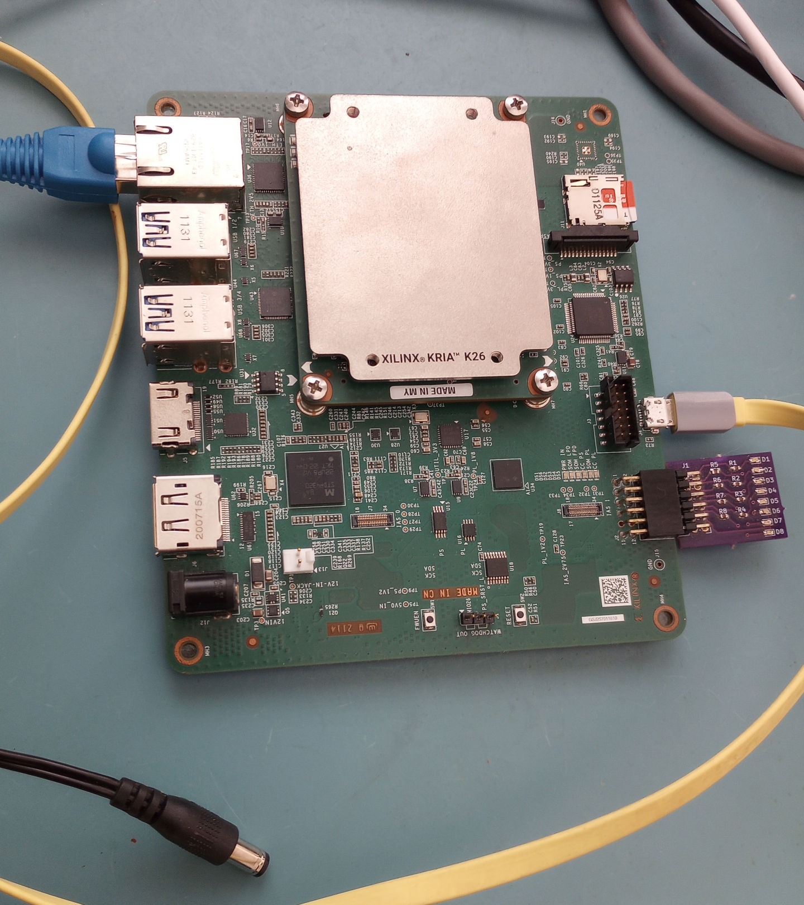

# kria_ubuntu
This is a project to demonstrate Xilinx Kria K26i running Ubuntu. The 2025.1 version of Vivado and Petalinux are used.

## Files
    - source - fpga source
    - implement - fpga compilation scripts
    - petalinux - petalinux build instructions
    - apps - C applications that access the FPGA under linux on the Kria

