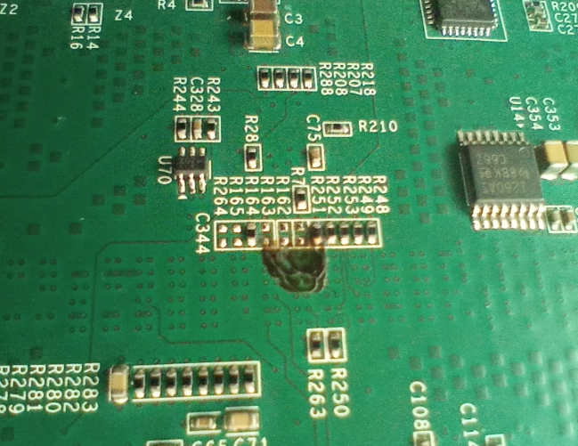

# Petalinux (2025.1) on Kria K26i

## Building Petalinux
These instructions assume the K26i boot mode is set to boot from the SD card. See instructions below for two ways to do this with the KV260 dev kit.

### Download and uncompress sstate artifacts
I find that the compile time download from petalinux.xilinx.com is unreliable. The trick is to have those files local. Then, in petalinux-config we point to the local files.

https://www.xilinx.com/support/download/index.html/content/xilinx/en/downloadNav/embedded-design-tools.html

    - Downloads         (TAR/GZIP - 61.27 GB) 
    - sstate_aarch64    (TAR/GZIP - 33.95 GB) 

### Convert XSA to SDT
The vivado compile script produces an XSA file with bitstream included. Petalinux 2024.2 and later require SDT files.

rm -rf ./sdt/; /tools/Xilinx/2025.1/Vitis/bin/sdtgen -eval "set_dt_param -dir ./sdt -xsa ../implement/results/top.xsa -user_dts ./system-user.dtsi; generate_sdt;"

### Create Petalinux project
petalinux-create project --template zynqMP --name proj1
cd proj1

### configure project from hardware
petalinux-config --get-hw-description=../sdt/

    * Image Packaging Configuration -> Root Filesystem Type -> EXT4                         (because we want a persistent rootfs)
    * Image Packaging Configuration -> Device node of SD device -> mmcblk1p2                (because we have the eMMC device enabled in Vivado IPI)
    * Subsystem Auto Hardware Settings -> SD/SDIO Settings -> Primary SD/SDIO -> sdhci1     (because we have the eMMC device enabled in Vivado IPI)
    * DTG Settings -> Kernel Bootargs -> manual bootargs -> earlycon console=ttyPS0,115200 root=/dev/mmcblk1p2 rw rootwait clk_ignore_unused (mmc 1, rw, clk_ignore_unused)

    * Yocto Settings -> Local sstate feeds settings -> local sstate feeds url ->    file://~/Downloads/xilinx/petalinux/sstate_download_2025_1/aarch64/
    * Yocto Settings -> Add pre-mirror url ->                                       file://~/Downloads/xilinx/petalinux/mirror_download_2025_1/downloads/

    * save and exit

### Build the bootloader
petalinux-build -c bootloader -x distclean

### Configure the kernel
petalinux-config -c kernel --silentconfig

### Build
petalinux-build

### Package 
petalinux-package boot --force --u-boot --fpga

    * Use this to just update the bitfile.

petalinux-package boot --force --u-boot --fpga ../../implement/results/top.bit

### Prepare an SD card
    * put an SD card in an adapter and plug into your workstation.
sudo gparted
    * select your SD card from the pull down in the upper right (WARNING: select the correct device because it will be erased.)
    * Create a 500MB FAT32 partition named BOOT.
    * Create a ext4 partition named rootfs. Use the rest of the card.

### Copy to SD Card
cp images/linux/BOOT.BIN /media/pedro/BOOT/; cp images/linux/image.ub /media/pedro/BOOT/; cp images/linux/boot.scr /media/pedro/BOOT/; sync

## Installing a Debian root filesystem using debootstrap
See: https://akhileshmoghe.github.io/_post/linux/debian_minimal_rootfs

Here are the most important commands listed for convenience. 

    sudo apt install qemu-user-static
    sudo apt install debootstrap

    sudo debootstrap --arch=arm64 --foreign bookworm debianMinimalRootFS
    sudo cp /usr/bin/qemu-aarch64-static ./debianMinimalRootFS/usr/bin/
    sudo cp /etc/resolv.conf ./debianMinimalRootFS/etc/resolv.conf
    sudo chroot ./debianMinimalRootFS
    export LANG=C

    /debootstrap/debootstrap --second-stage (this takes several minutes)

Add these sources to /etc/apt/sources.list

    deb http://deb.debian.org/debian bookworm main contrib non-free-firmware non-free
    deb http://deb.debian.org/debian bookworm-updates main contrib non-free-firmware non-free
    deb http://security.debian.org/debian-security bookworm-security main contrib non-free-firmware non-free

    Do some more file system configuration.

    apt update
    apt install locales dialog
    dpkg-reconfigure locales
    apt install vim openssh-server ntpdate sudo ifupdown net-tools udev iputils-ping wget dosfstools unzip binutils libatomic1
    passwd
    adduser myuser
    usermod -aG sudo myuser
    usermod --shell /bin/bash <user-name>

    Add to /etc/network/interfaces

    auto end0
    iface end0 inet dhcp

    Exit chroot.

exit
    Write filesystem to SD card.

sudo cp --recursive --preserve ./debianMinimalRootFS/* /media/pedro/rootfs/; sync

## Miscellaneous

### KV260 Boot Mode Resistors
In order to boot directly from the SD card on the KV260 dev kit, R162 and R163 were removed from the carrier card. This makes boot mode[3:0] = 1110 = SD1 LS (3.0).
Note that the reference designators on these resistors is not aligned wit the parts. R162 is to the right of R7. Then R163, R164 and R165 continue down the column. At the bottom of the column are R264 and C344.

### Trick Kria u-boot to reboot from SD card
This can be used to boot from the SD card on a KV260 board with the resistors still set to QSPI32 and the default Kria KV260 bootloader. First the default bootcmd variable is saved as oldbootcmd. Then a new sdbootcmd variable is created that writes 0xE (SD1 3.0) to the alt-boot field of the boot control register and then asserts the alt-boot bit (See the TRM). Then bootcmd is set to run the sdbootcmd. The new environment settings are saved and a boot command is issued.  From now on u-boot will run but then force a reboot directly from the SD card on the KV260.

    setenv oldbootcmd 'setenv model $board_name; setexpr model gsub ".*${k24_starter}.*" starter; setexpr model gsub ".*${k26_starter}.*" starter; if test ${model} = "starter"; then run som_cc_boot; else run som_bootmenu; fi # Boot menu'
    setenv sdbootcmd 'mw.l 00ff5e0200 0000e100 1; mw.l 00ff5e0218 00000010 1'
    setenv bootcmd 'run sdbootcmd'
    saveenv
    boot

### eMMC drive
The 16GB eMMC memory is enabled in the Vivado design.  These instructions make /dev/mmcblk0 showup under Linux.

    sudo fdisk /dev/mmcblk0
        - create new partition (n) accept defaults
        - write partition table (w)
    sudo mkfs.ext4 /dev/mmcblk0p1
    sudo mkdir /mnt/emmc
    sudo mount /dev/mmcblk0p1 /mnt/emmc

    sudo vi /etc/fstab

/dev/mmcblk0p1  /mnt/emmc/  ext4  defaults  0  1

### Run-time FPGA Configuration
Modify your FPGA build script to produce a .bin file in addition to the normal .bit file. The FPGA example in this project has that command in compile.tcl.
    
cp .../fpga/implement/results/top.bin to /lib/firmware

sudo su

echo top.bin > /sys/class/fpga_manager/fpga0/firmware

